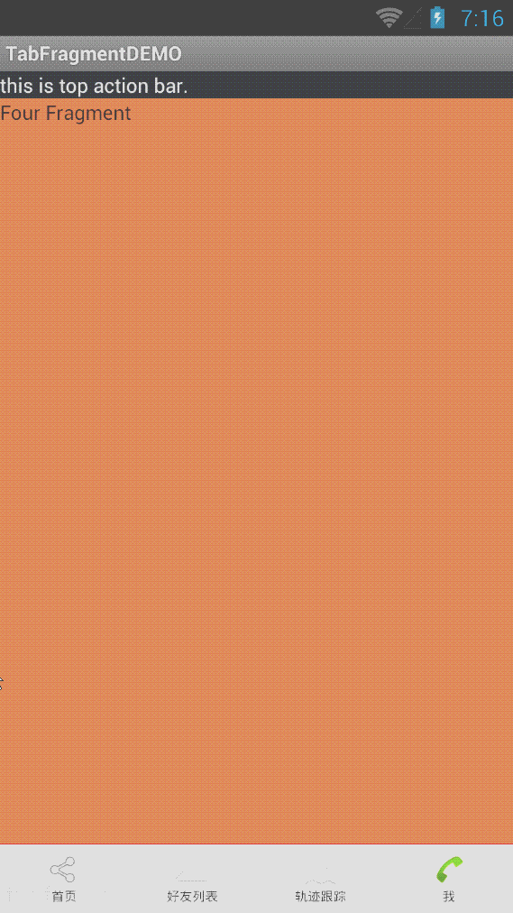

# TabDemo
使用Activity方式和使用Fragment两种方式实现的TAB实例

网有不少的例子，但是要么是像微信一样可是没有使用Fragment实现，要么是只实现了一个很简单的切换，没有下面的菜单页。这个例子有实现了，我觉得暂时够我用了

----------------------------------------

使用了开源库：JazzyViewPager
注意：在实际使用中请注意相关代码的改写。

--------------------------------
##实现类：
+ MainTabFragmentActivity	Fragment的实现方式 ， 推荐使用
+ MainTabActivity	Activity的实现方式

##效果：
How does it look?
------------------------------

